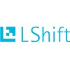

# Dr James Uther

james.uther at gmail.com | [@hemul](https://twitter.com/hemul)

A senior software engineer and architect with over 25 years industry experience who successfully delivers innovative products, and improves the effectiveness of teams.

- Proven technical skills ranging from embedded systems programming to UI design, scalable cloud systems to desktop visualisations. Experience across a wide variety of platforms and languages.
- Strong leadership and communication skills targeted towards shipping successful products, and initiating change to improve sustainable team performance.
- Ability to create and own an architectural vision for a project, and drive the vision to a quality implementation. Has done this in small companies, multinationals, and universities, on projects both large and small.

## Key Skills
Software development, strategy, architecture & management. Ability to influence and coordinate across expertise boundaries. Development methods, including scrum/agile. UI & visualisation design. Product prototyping and iteration. Team leadership. A variety of programming languages ranging from object-oriented to functional, and proven ability to rapidly become productive in new technologies. Recently used languages include [Python](http://xkcd.com/353/), Java, Scala, Clojure, C++, TypeScript, JavaScript and C#, and they have been used in a range of environments. I have contributed to and initiated open source projects. 

# History

## Lead Senior Engineer
### Oliver Wyman, London, UK
### Dec 2016 - now.

LShift was acquired by Oliver Wyman to form the core of their technology delivery capability. Since then I've been involved in various projects, mostly in the financial space.

## Senior Developer
### LShift, London, UK
### Nov 2012 – Dec 2016

"LShift is a hi-tech software development company. It is small but, we like to think, close to perfectly formed. Our company is home to some of the best developers in the UK - not only in our opinion, but in the opinion of a number of international blue chip companies who use our development and research skills."

LShift has been successfully delivering agile projects for blue-chip clients for more than 10 years. They are technology agnostic, preferring to use whatever best delivers business benefit.
Senior Developer is the only developer/architect role in the company, and is unique in that enormous freedom is given to own and direct all aspects of a project (from technical to client relationship), along with enormous responsibility to deliver. Given the exceptional caliber of the staff, this works well. Projects have ranged from data-mining open NHS data to building highly secure messaging platforms.
I joined LShift for the chance to work with such talent (and humour). I did learn a lot of technology, but the most important secret I learned was how to reliably deliver complex projects.
Technologies used so far: Clojure, Go, BigQuery, Scala, JavaScript, TypeScript, C#, F#, Docker & Kubernetes, AWS, GCE/GKE, Hadoop, Spark, ElasticSearch, and many more.
Trained in [DSDM](http://www.dsdm.org/) agile project management.

## Research Fellow
### University of Sydney, Sydney, Australia
### May 2012 – Nov 2012

The [Computer Human Adapted Interaction](http://chai.it.usyd.edu.au/) lab conducts research in [ubiquitous computing](http://www.ubiq.com/hypertext/weiser/UbiHome.html). "We are exploring the technical means by which people can make sense of what it means to ‘own’ and visualise their data in a digital world. We currently focus on e-learning and health." 
Within this role, I was lead architect and developer on a [Personis](http://chai.it.usyd.edu.au/Projects/Personis), a research system offering methods for users to intelligently manage and use their online profile and support [Lifelong User Modelling](http://chai.it.usyd.edu.au/Projects/LLUM). I also led and taught a group of computing science students from one of the most prestigious universities in Australia. 

## Senior Architect
### Nokia, Farnborough, UK
### Feb 2005 – Sep 2011

Various roles, including software Team Lead and Software Architect for a number of phone programs, architect for new product ideas, global architect for an important new software technology within a key development team, and member of a global team responsible for a number of high-priority architecture and technology initiatives.

- Initiated and delivered a successful cultural change effort in the company to start removing ‘technical debt’ from a very large C++ asset.
- Helped ensure a global software organisation became fully fluent in Qt, a C++ development framework; training programs, architecture changes, roadmaps, and coding practises. The organisation consistently delivered high quality designs & software in Qt. Also worked with the Qt team to ensure roadmap alignment.
- Responsible for starting the development of a number of handset features. For example, the FM transmitter involved building consensus between marketing, UI, hardware, system and application teams to deliver the feature within the product schedule. I was also involved in graphics architectures, novel input devices, context awareness and some other smaller projects.
- Responsible for the architecture of product specific software for some product programs. Released products include [N80](http://en.wikipedia.org/wiki/Nokia_N80) and [N78](http://en.wikipedia.org/wiki/Nokia_N78). Contributions were also made to the [N79](http://en.wikipedia.org/wiki/Nokia_N79), [E72](http://en.wikipedia.org/wiki/Nokia_E72) and [E6](http://en.wikipedia.org/wiki/Nokia_E6) among others.
- Software Lead for the N80. This involved work allocation, mentoring, reviews for permanent team members, etc. Also responsible for driving software maturity within the product.

## Senior Consultant / Team Leader
### Mobile Innovation, London UK
### Feb 2003 – Feb 2005

Mobile Innovation was a leading user interface designer, product integrator and software developer for smartphones.

- Built and led a team that developed the C++ UI framework for Nokia’s first touch phones, the [Series 90](http://en.wikipedia.org/wiki/Nokia_Series_90) and [Series 80](http://en.wikipedia.org/wiki/Nokia_Series_80) Symbian platforms. I was instrumental in convincing Nokia to subcontract further work to us.
- Designed and developed UI unit testing and continuous integration systems for Symbian development (in Java and Python). Built an innovative parallel build system for Symbian that reduced builds from 24h to 4h.
- Line management of a team.
- Acted as a 'bridge' between the engineering and UI teams to keep communication working.

## Senior Software Engineer/Researcher
### F-Secure Corporation, Helsinki, Finland
### Feb 2000 – Feb 2003

F-Secure is a publicly listed software company based in Helsinki.

Founding member of the Usability Working Group & research project manager leading usability related research, future UI design and best practise usability within the company. (Java, JavaScript, XUL)

Java Competence Team Manager. Built and maintained the company's Java expertise. Architect and Team Leader for a large-scale server implemented in Java.

## Software Development Manager
### University of Sydney
### May 1994 – Sep 1999

I was the initial hire in this project, and responsible for the planning and implementation of the entire technology stack, from specifying, installing and running servers (web, sybase, mail, news, proxy, smb, etc) to developing the custom software that made the course possible.

Architect and lead developer of a large-scale, world-leading e-learning platform within the Faculty of Medicine using both client and server side Internet technologies. (Java, Python, JavaScript, SQL)

# Education

- Certified in the Dynamic Systems Development Method (DSDM) Agile Project methodology 
- Certified Sun Systems Administrator (1995)

## University of Sydney
### PhD Computer Science
### 1993 – 2001
Thesis: On the Visualisation of Large User Models in Web Based Systems

Activities and Societies: Academic Board Postgraduate Student Representative Association Director, Student Housing Cooperative

### MSc Computer Science
### 1991 – 1993
Research in architecture and user interfaces for educational software.

### BSc (Hons) Computer Science, Mathematics
### 1988 – 1991
Hons thesis in Digital Signal Processing

# Publications

See also writings listed in [my github page](https://github.com/jbu)

- Uther M, Zipitria I, Uther J & Singh P. (2005). Mobile Adaptive CALL (MAC): A case-study in developing a mobile learning application for speech/audio language training. IEEE Workshop on Mobile Technologies in Education, November 2005 to appear.
- Uther M, Singh P, Zipitria I & Uther J. MAC: An adaptive, perception-based speech remediation s/w for mobile devices. Artificial Intelligence in Education (AIED) workshop on language tutoring, July 2005.
- Uther M, Singht P & Uther J. Mobile Adaptive Call (MAC): a software for speech remediation. IEEE Pervasive services in computing, July 2005.
- Apted T, Kay J, Lum A & Uther J. (2003). Visualisation of ontological inferences for user control of personal web agents. E Banissi, K Borner, C Chen, G Clapworthy, C Maple, A Lobben, C Moore, J Roberts, A Ursyn, Jian Zhang (eds), Proceedings of IV03-VSW, Information Visualisation - Semantic Web Visualisation, IEEE, 2003, 306 -- 311. IEEE [link to paper](http://www.computer.org/portal/web/csdl/abs/proceedings/iv/2003/1988/00/19880306abs.htm) 
- Uther M, Uther J & Kay J. (2003). Visualising cohort comparisons with VlUM, Proceedings of CSCL, Computer Supported Co-operative Learning Conference, 114--116.
- Lum A, Kay J, Apted T & Uther J. (2003). Visualisation of learning ontologies. Poster at AIED03.
- Uther J & Kay J. (2003). VlUM, a Web-Based Visualion of Large User Models. Proceedings User Modeling, in Brusilovsky, P, A Corbett and F de Rosis (eds), Springer-Verlag in Lecture Notes in Artificial Intelligence (LNAI/LNCS), 198--202. [link to paper](http://www.springerlink.com/content/ycdlthmgvlb7/) 
- Uther J. (2001). On the visualisation of large user models in web based systems. Ph.D. Thesis. [link to thesis](http://www.cs.usyd.edu.au/~jimu/thesis.pdf)
- Uther J & Kay J. (1999). Describing and Viewing Large User Models. In D. Hawking and R. Wilkinson, Editors. Australian Document Computing Symposium, 1999, p 81-84.
- Uther J & Kay J. (1998). Compact Display of Large User Models. Paper presented at the Sydney Visual Information Processing Meeting. [link to paper](http://www.cs.usyd.edu.au/~jimu/vis.pdf)
- Uther J & Taylor V. (1998). Fusing Dynamic and Static Web Sites. Paper presented at the Sydney Document Computing Symposium. [link to paper](http://www.cs.usyd.edu.au/~jimu/fusing.pdf)
- Carlile S, Barnet S, Sefton A, Uther J. (1998). Medical problem based learning supported by intranet technology: a natural student centred approach. International Journal of Medical Informatics 50 (1998) 225-233.
- Uther, J (1997). It's Just A Web Site. Presentation given at the WWW7 Satellite Conference on Medical Education, University of Sydney.
- Carlile S, Sefton A, Uther J, Barnet S. (1997). MedEdNet: A Faculty wide intranet to support an integrated medical curriculum at the University of Sydney. AusWeb97. [link to presentation](http://ausweb.scu.edu.au/proceedings/carlile/presentation.html)
- Uther, J (1994). A Useable Boxer Editor. Proceedings of OZCHI 94. p 53-58.
- Uther, J (1993). An Editor for the BOXER Computing Environment. Proceedings of the Fifth International Conference on Human-Computer Interaction. Abridged Proceedings 1993 v.3 p.210
- Uther, J (1993). A Boxer Architecture and Interface. Masters thesis. [link to thesis](http://www.cs.usyd.edu.au/~jimu/mastersThesis.pdf)
